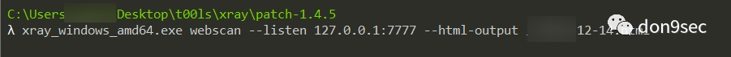

```
标题: 记一次 hw 打点
创建: 2020-12-18
更新: 2024-02-03
```

> 从 CN-SEC 找回的旧文

---

对于hw来说，即使是团队合作，web选手分到的资产都是成百上千，这种时候如果都不来点"佛系"挖洞姿势，那我这种面临期末预习的菜鸡选手还能好好睡觉刷剧看电影吗？


(已知目标为xxx.com)

拿到目标xxx.com,先获取子域名(xray)


```shell
xray subdomain --target xxx.com --text-output xxx.txt
```


整理获得的子域名资产合并至url.txt, 与rad同目录


此时，躺着"打点"的思路就来了：


（1）写个脚本实现rad的批量任务,并让流量经过burp代理


推荐：https://github.com/timwhitez/rad-xray

（2）burp起个upstream代理，然后让rad的流量从burp转出(使用插件实现漏洞监测，比如shiro)


插件推荐：

ShiroScan
- https://github.com/amad3u4/ShiroScanner/

J2EEScan
- https://github.com/PortSwigger/j2ee-scan

Struts RCE 1.0
- https://github.com/prakharathreya/Struts2-RCE

FastjsonScan
- https://github.com/p1g3/Fastjson-Scanner

（3）然后xray监听由burp转发过来的流量，进行漏洞检测



最终便完成由被动扫描到主动扫描的"摸鱼"行为。

---

burp:


xray:


