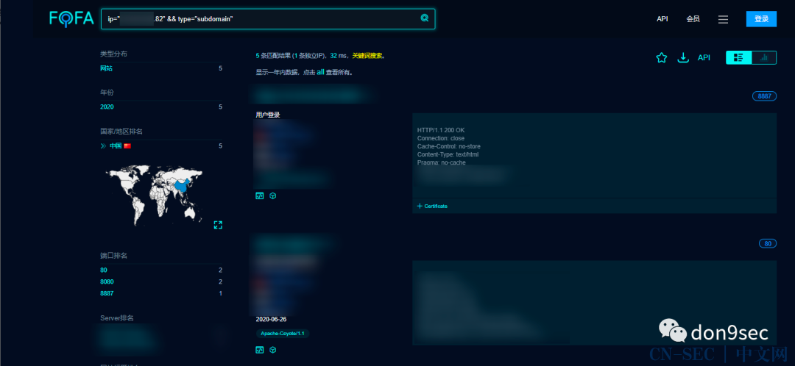

```
标题: 记一次对 ueditor 的捡漏之旅
创建: 2020-12-20
更新: 2024-02-03
```

> 从 CN-SEC 找回的旧文


---

（已知目标ip为1.1.1.1）

使用fofa看看有哪些web服务：



我一般会习惯性的F12、刷新看看网站会加载哪些资源（总会出现一些奇妙的路径）

如图：


ueditor+jsp
- SSRF
- 目录遍历
- 文件上传 => Stored XSS
- 反射型XSS

首先确定ueditor的版本


阅读js源码发现，可以在控制台通过UE.version获得editor的版本

```js
console.log(UE.version)
```


SSRF

已知该版本ueditor的ssrf触发点：

```
http://1.1.1.1:8080/cmd/ueditor/jsp/controller.jsp?action=catchimage&source[]=https://www.baidu.com/img/PCtm_d9c8750bed0b3c7d089fa7d55720d6cf.png
```

成功，ssrf一枚！


对于后续利用姿势：
- 内网探测
- 应用识别
- 漏洞利用
- ......

简单叙述一下扩大战果的思路：
进行内网探测，查看内网开放的主机和端口。然后通过访问开放的端口返回的一些特征去识别在该服务器上部署的服务与应用，最后针对性地采用一些payload去判断是否存在漏洞。
这里附上ssrf内网探测的脚本：

(来源:猎户攻防实验室)


---

希望自己在每一次的复盘中都能有所收获。
在我看来，学习的目的并不是为了证明你学到了什么，而是在每一次的学习/工作中去发现自己还有哪些技能/知识没有掌握，然后去跟进学习。

