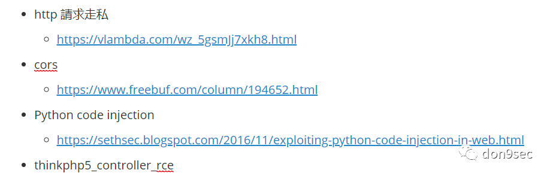
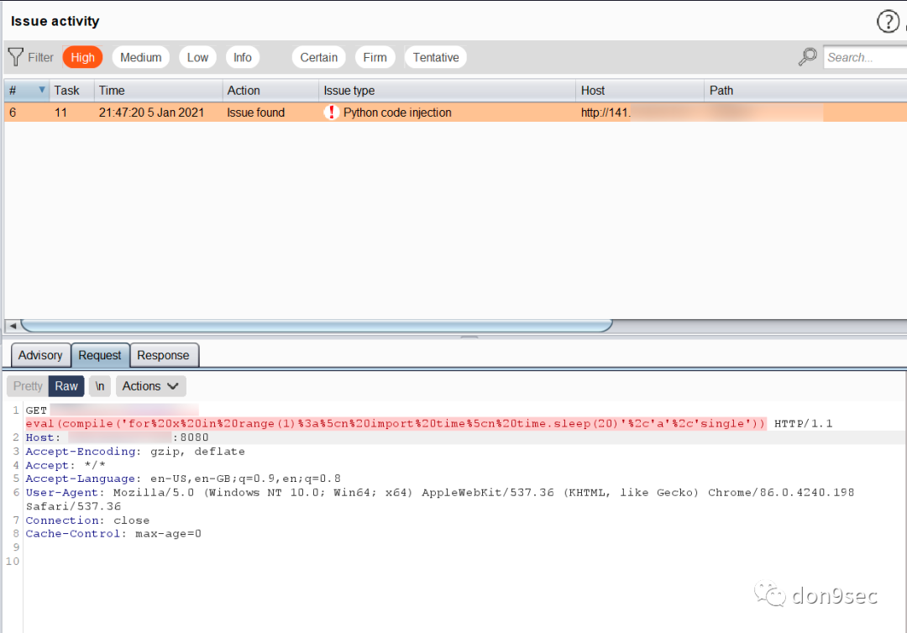
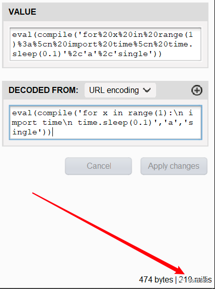
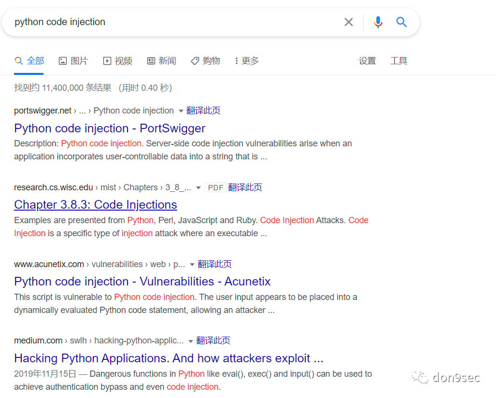
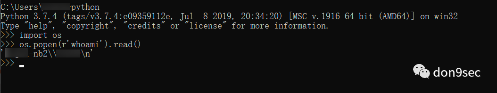
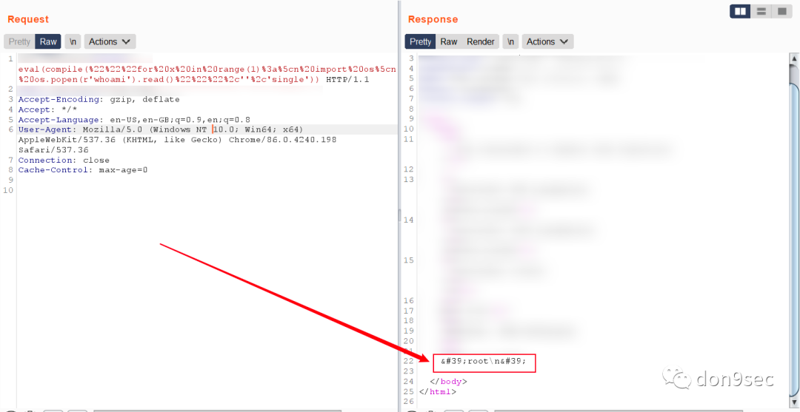
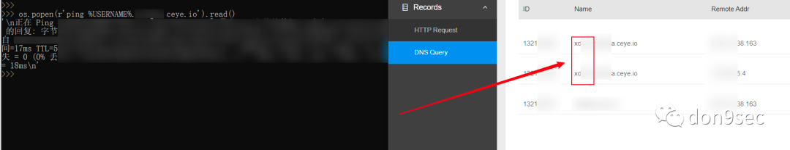
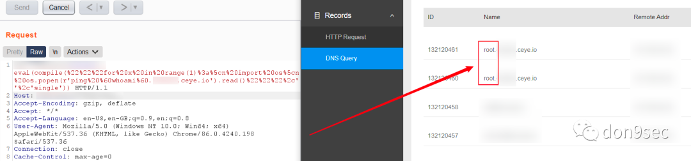
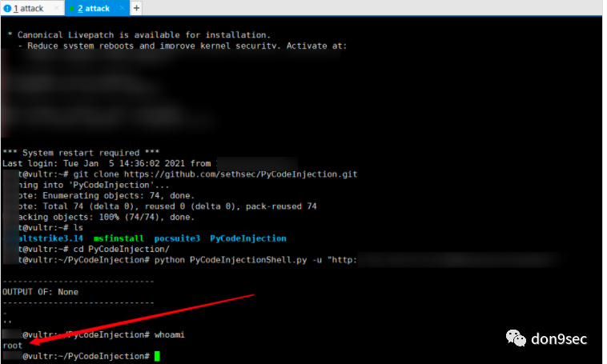

```
标题: 记一次 Python Code Injection 实战
创建: 2021-01-05
更新: 2024-02-03
```

> 从 CN-SEC 找回的旧文


---


测试环境已获得授权


### 凑字數

剛過完年就搬砖搬到北京來了！！！

简单地記錄一下這幾天的工作产出(BurpSuite 永遠的神！！！)



這篇文章主要是對python code injection 的復現學習。

### 正文

开局一张图



burp内置的payload:
```
eval(compile('
for x in range(1):\n 
import time\n 
time.sleep(20)','a','single'))
```
作用：通過响应包的返回時間是否延遲來判斷是否存在漏洞。

注：該payload在遇上 timeout 時會有誤報，比如今天白高興一早上的我🙈。

所以先验证該漏洞是否為誤報：

payload1:




可以看見相差10倍左右的延遲，实锤！实锤！实锤！

接下來的操作自然是以拿到权限爲主。

#### 临时抱佛脚

其实這就是实习(经验)帶來的好處，当然这是對於我而言。一般在項目中遇到各種情況，然後 学习新知识 -> 解决问题 -> 总结经验。



通過本地各种尝试之後，終於搞清楚了payload的构造原理，現在便可以根据心情自由發揮了。

本地測試：



漏洞環境：



本地測試：



漏洞環境：



#### 反彈shell

如圖：


---

參考：

https://github.com/sethsec/PyCodeInjection
https://sethsec.blogspot.com/2016/11/exploiting-python-code-injection-in-web.html


