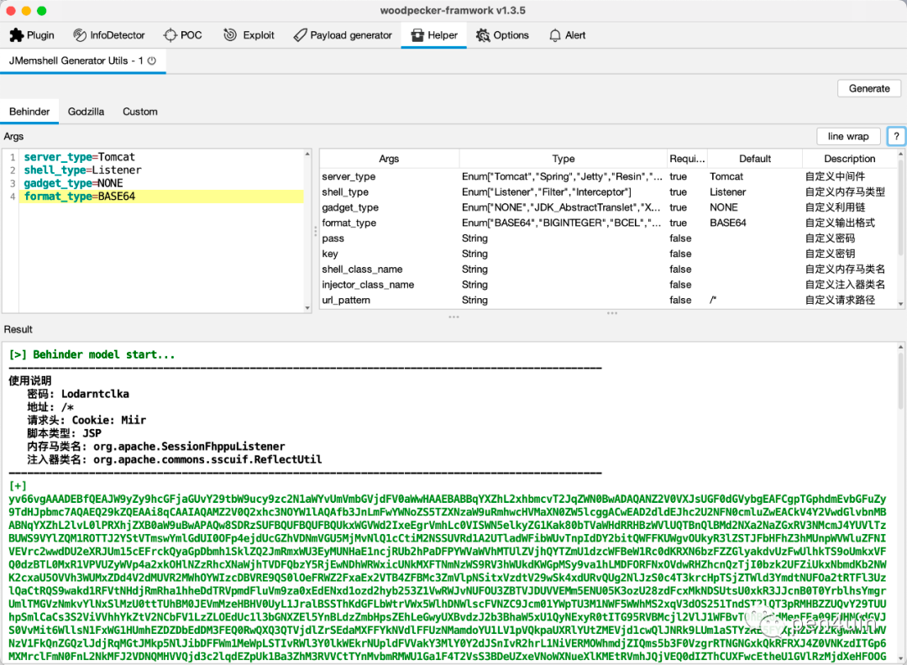
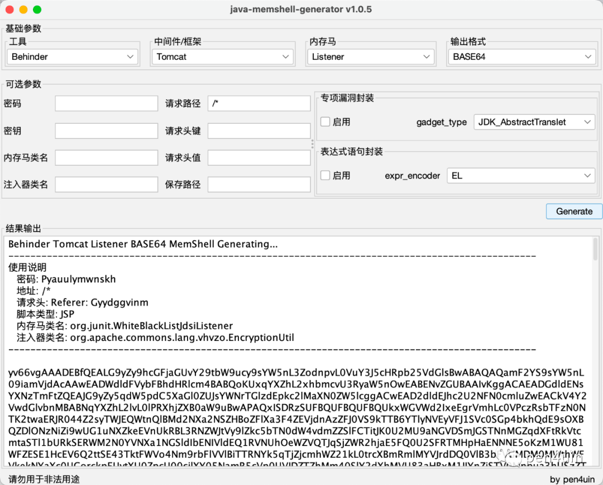

```
标题: jMG v1.0.6
创建: 2023-06-10
更新: 2024-02-25
```

[首发微信订阅号](https://mp.weixin.qq.com/s/QjoRs_J5jVANrdEiiTtVtA)

---

### 0x01 前言

上篇文章中介绍了该工具作为 woodpecekr 插件的工作模式，并通过多个代码执行漏洞场景进行了演示。

本篇文章是在添加对GUI 工作模式支持后的补充。

### 0x02 工具简介

**jMG (Java Memshell Generator)** 是一款支持高度自定义的 Java 内存马生成工具，提供常见中间件的内存马注入支持。不仅可作为 woodpecker 的插件使用，也可以作为独立的 GUI 工具进行使用，文档详见公众号文章。

下载地址：

[java-memshell-generator-release](https://github.com/pen4uin/java-memshell-generator-release)


### 0x03 工作模式

#### 插件 for Woodpecker



#### 独立 GUI 




### 0x04 最后


> [!WARNING] 
> 免责声明
> 
> 该工具仅适用于在授权环境/测试环境进行使用，请勿用于生产环境。


致谢

```
https://github.com/feihong-cs/memShell
https://github.com/su18/MemoryShell
https://github.com/BeichenDream/GodzillaMemoryShellProject
https://github.com/woodpecker-framework/
https://github.com/woodpecker-appstore/jexpr-encoder-utils
```

---

[LEAVE A REPLY](https://github.com/pen4uin/blog-feedback/issues/new)


