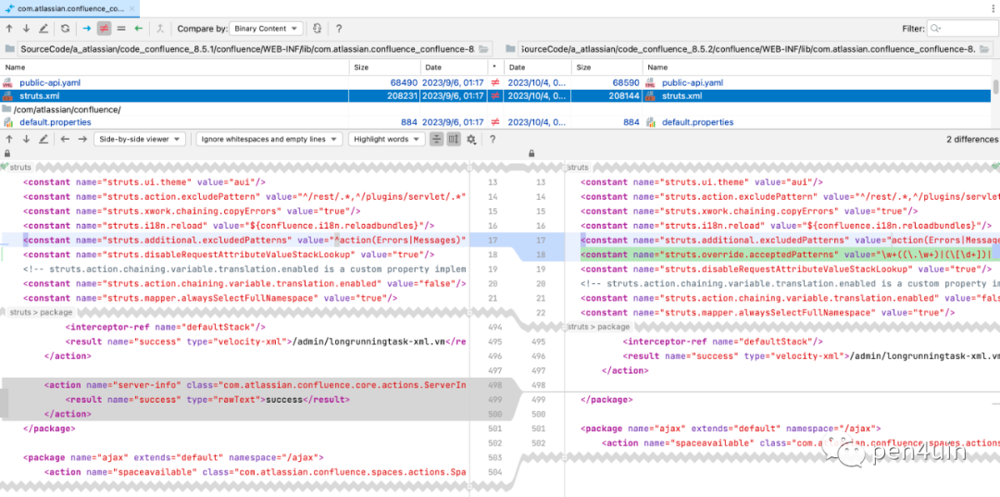
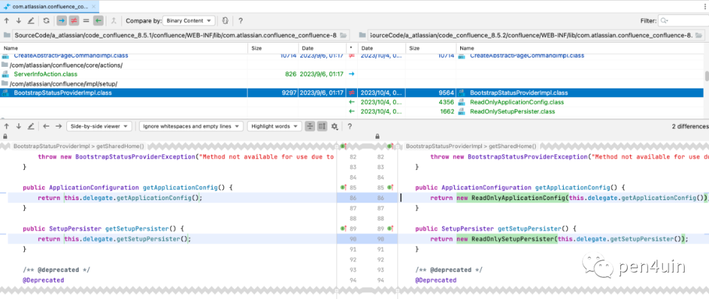

```
标题: Confluence CVE-2023-22515
创建: 2023-10-10
更新: 2023-10-10
```

[首发微信订阅号](https://mp.weixin.qq.com/s/rIfYrO1i4LPpgCGyxSLHUg)

---

### 0x01 写在前面

> 本篇文章只做分析，不提供可利用 payload

上周三，Atlassian 在安全公告日发布了 CVSS 评分为 10分的 CVE-2023-22515， 假期写了篇简陋的复现笔记发在司内部群里。现在距离通告发布已经快一周了，目前还没看到有人公开细节，索性把简陋笔记补充后拿来丰富一下公众号内容，虽然很久不发漏洞分析了，但这个洞我觉得应该值得一篇原创。


### 0x02 漏洞分析

#### 漏洞通告分析

由漏洞通告可以定位到 `/setup/*` 系列路由，刚开始以为直接访问 `/setup/setupadministrator.action` 添加管理员就行，当搭好环境进行测试时

- 会提示已经完成安装（Setup is already complete），说明这里需要进行绕过


#### 修复版本对比

- 建议选择修复版本的相邻版本进行分析，干扰会小一些

confluence 的核心代码在 com.atlassian.confluence_confluence-8.x.x.jar，使用 idea 进行对比，发现有两个值得注意的变动

1、struts2.xml

- 修复版本新增了 struts.override.acceptedPatterns
- 修复版本删除了 server-info action



2、BootstrapStatusProviderImpl

- 修复版本对属性 setupPersister 和 applicationConfig 做了限制



- 对比这两个属性 ReadOnly 前后的差异
  - 可以发现修复版本对 setter  进行了重写


只要对 struts2 系列漏洞原理有所了解，看到这儿应该就大致可以理解该漏洞了；如果看到这里还没有思路，建议背诵 su18 大哥的 《Struts2 系列漏洞调试总结》 一文

漏洞触发点在 struts2 框架中的位置图 （by su18）


结合这张图对所有 interceptor 进行分析，最终定位到漏洞点 -> ParametersInterceptor

```xml
<interceptor name="params" class="com.atlassian.xwork.interceptors.SafeParametersInterceptor"/>
```

定位到漏洞点后，就该考虑如何使请求走到 params interceptor 中

根据配置文件的如下配置，可以发现有两个  interceptor stack 中定义了  params interceptor

- defaultStack

```xml
<interceptor-stack name="defaultStack">
    <interceptor-ref name="profiling">
        <param name="location">Before defaultStack</param>
    </interceptor-ref>
    <interceptor-ref name="securityHeaders"/>
    <interceptor-ref name="setupIncomplete"/>
    <interceptor-ref name="transaction"/>
    <interceptor-ref name="params"/>
   ...
</interceptor-stack>
```

- opensearch

```xml
<interceptor-stack name="opensearch">
    <interceptor-ref name="securityHeaders"/>
    <interceptor-ref name="transaction"/>
    <interceptor-ref name="params"/>
   ...
</interceptor-stack>
```

所以只需要找到指定了defaultStack / opensearch  作为 interceptor stack 的action 即可

这里其实会有一个疑问，v8.x 之前版本使用的 xwork 框架也是存在类似问题的，但为什么不受该CVE影响呢？


#### 利用思路整理

1、大致思路

利用 ParametersInterceptor 的属性覆盖绕过 `/setup/*` 路由的限制，访问  `/setup/setupadministrator.action`  添加管理员

2、需要覆盖属性是什么

具体的属性应该和 setupPersister 和 applicationConfig 相关联，因为修复版本对其做了限制

3、如何定位该属性

- 每个人都有自己不同的经验参考，这里以响应 title 作为破题点

步骤如下：


4、思路补充

找到能触发 ParametersInterceptor 的 action，然后覆盖 setupComplete 绕过 SetupCheckInterceptor 对 `/setup/*` 路由的限制，然后访问  `/setup/setupadministrator.action`  添加管理员。


### 0x03 漏洞复现

1、正常访问，提示已经完成安装（Setup is already complete）

```
GET /setup/setupadministrator-start.action HTTP/1.1
Host: 10.37.129.6:8090
Connection: close

```


2、覆盖 setupComplete 属性

```
POST /xxxxxx.action HTTP/1.1
Host: 10.37.129.6:8090
Connection: close
Content-Type: application/x-www-form-urlencoded
Content-Length: 61

[打码]
```

3、成功绕过，添加管理员即可


### 0x04 漏洞复盘

解答一下遗留问题
- v8.x 之前的版本使用的 xwork 框架也存在类似问题的，但为什么不受该CVE影响呢

**7.19.15**

- confluence-7.19.15.jar!/xwork.xml

```xml
<interceptor name="params" class="com.atlassian.xwork10.interceptors.SafeParametersInterceptor"/>
```
SafeParametersInterceptor 操作属性的实现在 SafeParametersInterceptor#before 中，这里解析的参数都是经过安全过滤的，所以无法进行利用

```java
protected void before(ActionInvocation invocation) throws Exception {
    if (!this.shouldNotIntercept(invocation)) {
        Action action = this.versionSupport.extractAction(invocation);
        // 这里做了安全限制，对传入的参数进行了过滤，对代码细节感兴趣的读者可自行分析
        Map<String, Object> parameters = this.filterSafeParameters(ActionContext.getContext().getParameters(), action);
        ...
            if (parameters != null) {
                OgnlValueStack stack = ActionContext.getContext().getValueStack();

                Map.Entry entry;
                String name;
               // 解析经过过滤后的参数（参数名实际上就是OGNL语句）, 这里也就解释了为什么低版本“目前”无法利用的原因
                for(Iterator var6 = parameters.entrySet().iterator(); var6.hasNext(); stack.setValue(name, entry.getValue())) {

```

**8.0.0**

- com.atlassian.confluence_confluence-8.0.0.jar!/struts.xml

```xml
<interceptor name="params" class="com.atlassian.xwork.interceptors.SafeParametersInterceptor"/>
```

SafeParametersInterceptor 操作属性的实现在 SafeParametersInterceptor#doIntercept 中

```java
public String doIntercept(ActionInvocation invocation) throws Exception {
    this.before(invocation);
    return super.doIntercept(invocation);
}

```
分析 this.before() 可以发现其实和旧版版的实现是差不多的，”目前“不存在漏洞

```java
protected void before(ActionInvocation invocation) throws Exception {
    if (!this.shouldNotIntercept(invocation)) {
        Action action = (Action)invocation.getAction();
        Map<String, Object> parameters = this.filterSafeParameters(this.retrieveParameters(invocation.getInvocationContext()), action);
        ...
            if (parameters != null) {
                ValueStack stack = ActionContext.getContext().getValueStack();

                Map.Entry entry;
                String name;
                for(Iterator var6 = parameters.entrySet().iterator(); var6.hasNext(); stack.setValue(name, entry.getValue())) {

```

**重点来了**，后续调用了 super.doIntercept()，其对参数没有任何安全处理，直接就触发了 ognl sink setValue，造成属性覆盖，因此可以被利用

```java
// com.opensymphony.xwork2.interceptor.ParametersInterceptor#doIntercept
 public String doIntercept(ActionInvocation invocation) throws Exception {
    Object action = invocation.getAction();
    if (!(action instanceof NoParameters)) {
        ActionContext ac = invocation.getInvocationContext();
        // 获取传入的参数
        HttpParameters parameters = this.retrieveParameters(ac);
        if (LOG.isDebugEnabled()) {
            LOG.debug("Setting params {}", this.getParameterLogMap(parameters));
        }

        if (parameters != null) {
            Map<String, Object> contextMap = ac.getContextMap();

            try {
                ReflectionContextState.setCreatingNullObjects(contextMap, true);
                ReflectionContextState.setDenyMethodExecution(contextMap, true);
                ReflectionContextState.setReportingConversionErrors(contextMap, true);
                ValueStack stack = ac.getValueStack();
                // 参数未经任何安全过滤，this.setParameters 中也没有其他安全过滤，直接触发 sink setValue
                this.setParameters(action, stack, parameters);
            }
        }
    }
}
```

到这里就完成了在代码层面完了对漏洞的分析和理解，至于后续的 rce 利用链，可以参考 CVE-2023-22508，当然也有更简单的姿势，就留给读者自行填坑了。


### 0x05 小结

挺有意思的一洞，只可惜 v8.x 之前的版本不受影响。

参考链接

```text
https://confluence.atlassian.com/security/cve-2023-22515-broken-access-control-vulnerability-in-confluence-data-center-and-server-1295682276.html
https://su18.org/post/struts2-5/
https://struts.apache.org/core-developers/parameters-interceptor
```

---

[LEAVE A REPLY](https://github.com/pen4uin/blog-feedback/issues/new)


