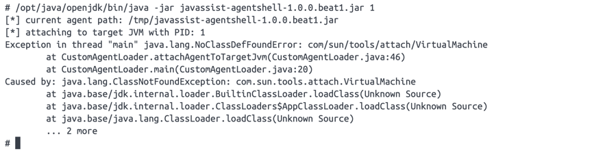
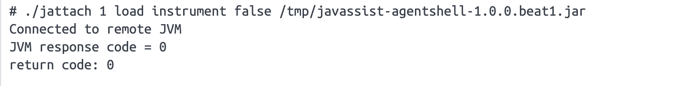
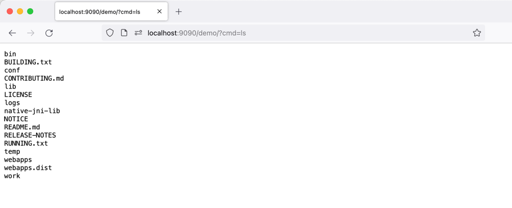

```
标题: JRE 环境注入 Java Agent
创建: 2024-01-26
更新: 2024-01-26
```

### 问题描述

这周和同事遇到了一个只装了 JRE 的场景，导致依赖 jdk 的 agent attach 失败，后面在 [arthas](https://github.com/alibaba/arthas/) 的 issue 里找到了解决方案，简单做下记录。

异常如下:
```text
Exception in thread "main" java.lang.NoClassDefFoundError: com/sun/tools/attach/VirtualMachine
```





### 解决方案

借助 [jattach](https://github.com/jattach/jattach)


```text
./jattach 1 load instrument false /tmp/javassist-agentshell-1.0.0.beat1.jar
```




### 测试效果

测试环境
- docker-compose.yml

```yaml
version: '3'

services:
  tomcat8.5-jre11:
    image: tomcat:8.5-jre11
    container_name: tomcat8.5-jre11
    ports:
      - "9090:8080"
    networks:
      - apps

networks:
  apps:
    driver: "bridge"
```



---

参考
```
https://github.com/alibaba/arthas/issues/2049
```


