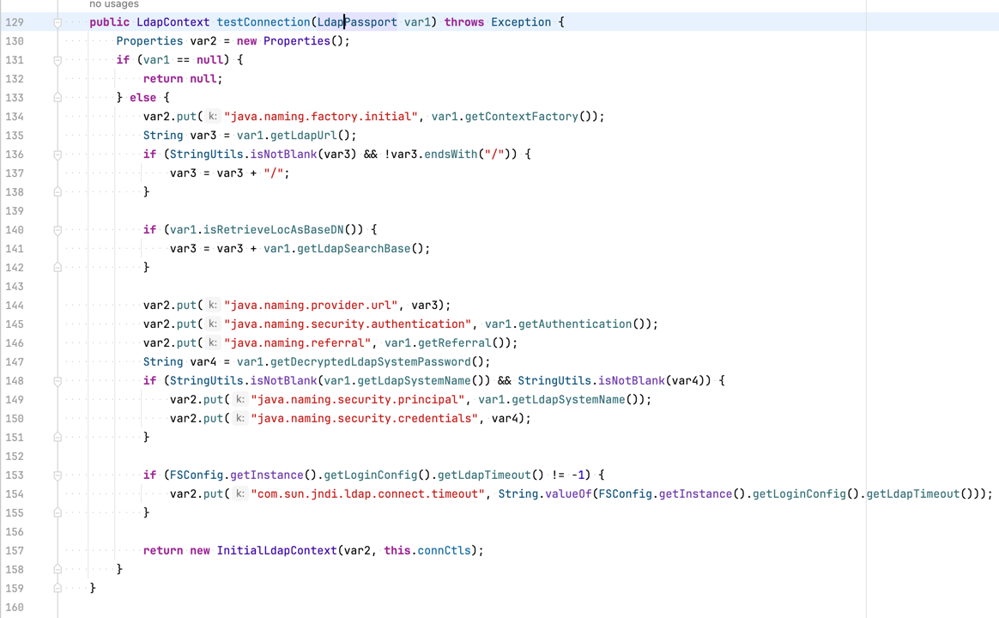
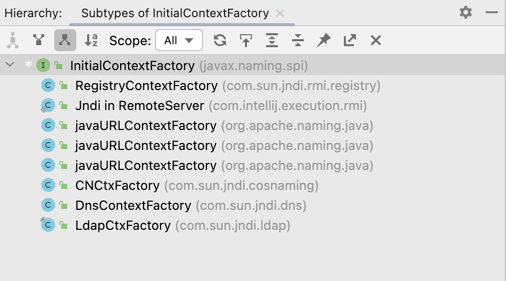

<table>
    <tr>
        <td><a href="">preview</a></td>
        <td><a href="index.md">raw</a></td>
    </tr>
</table>


---

代码片段
- Example#testConnection



提取有效信息
1. java.naming.factory.initial 可控
2. java.naming.provider.url    可控
3. 不存在常见 sink (lookup)


Q: 是否会导致 JNDI 注入漏洞 ? 

A: 会。

---

**这种写法为什么会导致漏洞呢？**

跟进 InitialContext 的初始化过程，可以发现在存在以下调用栈:
```text
getInitialContext, InitialContextFactory (javax.naming.spi)
getInitialContext, NamingManager (javax.naming.spi)
getDefaultInitCtx, InitialContext (javax.naming)
init, InitialContext (javax.naming)
<init>, InitialContext (javax.naming)
```

InitialContextFactory 是一个接口，具体调用哪个实现类的 getInitialContext 方法由 `java.naming.factory.initial` 参数决定。

如果要出洞，筛选对应的实现类，看有没有可以利用的实现类。



在 JDK 里找到了一个符合预期的类 `com.sun.jndi.rmi.registry.RegistryContextFactory`，其 getInitialContext 方法实现和调用关系如下:

```java
// com.sun.jndi.rmi.registry.RegistryContextFactory#getInitialContext
public Context getInitialContext(Hashtable<?,?> env) throws NamingException {
    if (env != null) {
        env = (Hashtable) env.clone();
    }
    return URLToContext(getInitCtxURL(env), env);
}

// RegistryContextFactory#getInitCtxURL 
// -> RegistryContextFactory#URLToContext 
// -> rmiURLContextFactory#getObjectInstance
// -> rmiURLContextFactory.getUsingURL

private static Object getUsingURL(String url, Hashtable<?,?> env) throws NamingException {
    rmiURLContext urlCtx = new rmiURLContext(env);
    try {
        return urlCtx.lookup(url);
    } finally {
        urlCtx.close();
    }
}
```

在 getUsingURL 方法中，调用了 rmiURLContext 的 lookup 方法， 其参数 url 由 `java.naming.provider.url` 决定，也是可控的，所以存在 JNDI 注入漏洞。

可复用的漏洞模式 (供参考):
- sink: 
  - javax.naming.InitialContext#InitialContext
  - javax.naming.directory.InitialDirContext#InitialDirContext
  - javax.naming.ldap.InitialLdapContext.InitialLdapContext
- condition: 
  - java.naming.factory.initial 可控
  - java.naming.provider.url    可控

---

[LEAVE A REPLY](https://github.com/pen4uin/blog-feedback/issues/new)

